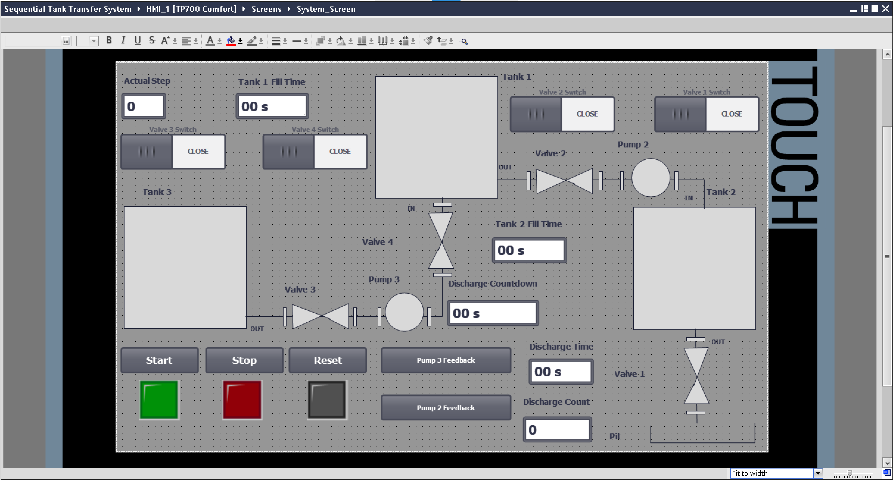

# Sequential-Tank-Transfer-System
A Siemens TIA Portal PLC implementation of an automated liquid transfer system that sequentially moves fluid from a source tank through two intermediate tanks before final discharge. Features timed transfer sequences, valve control logic, safety interlocks, and cycle counting functionality.

## System Overview
### Main Components
#### Tanks
- **Tank 3 (T3)**: Source tank - always full (like a water tower)
- **Tank 1 (T1)**: First receiving tank
- **Tank 2 (T2)**: Second receiving tank
- **Pit (PT)**: Final discharge destination

#### Control Elements
- **Start Button (PB_Start)**: Begins the process
- **Stop Button (PB_Stop)**: Safely stops all operations
- **Reset Button (PB_Reset)**: Resets the system after completion

#### Valves & Pumps
- **Valve 3 (V3)**: Controls liquid transfer from T3 to T1
- **Valve 4 (V4)**: Additional valve in the T3 to T1 transfer path
- **Valve 2 (V2)**: Controls liquid transfer from T1 to T2
- **Valve 1 (V1)**: Controls discharge from T2 to the Pit
- **Pump 3 (P3)**: Assists liquid transfer from T3
- **Pump 2 (P2)**: Assists liquid transfer to T2

## Process Sequence
### 1. System Preparation
- **_Ensure_** all valves and pumps are in their required state
- System performs safety checks
- Press the Start button to initiate the sequence

### 2. First Transfer (T3 to T1)
- Liquid flows from T3 into T1
- Transfer time: 10 seconds
- Utilizes Valve 3, Valve 4, and Pump 3

### 3. Second Transfer (T1 to T2)
- Once T1 is full, liquid moves to T2
- Transfer time: 20 seconds
- Utilizes Valve 2 and Pump 2

### 4. Discharge Sequence
- When T2 is full, system prepares for discharge (10 seconds)
- Liquid empties into the pit through Valve 1 (30 seconds)
- Process repeats for 5 complete cycles
- Discharge count is tracked on the HMI
  
### 5. Reset Procedure
- After 5 discharge cycles, the sequence is complete
- Press Reset to prepare for a new cycle
- Close all valves and stop all pumps **_before_** resetting

## Safety Features
- Emergency stop functionality
- Valve position monitoring
- Pump feedback monitoring
- Tank level overflow protection
- Real-time status indication through HMI

## HMI Interface
The HMI provides visual feedback of:

- Current process step
- Tank fill times and status
- Valve positions (Open/Close)
- Discharge countdown and timing
- Cycle counting
- Pump feedback status
